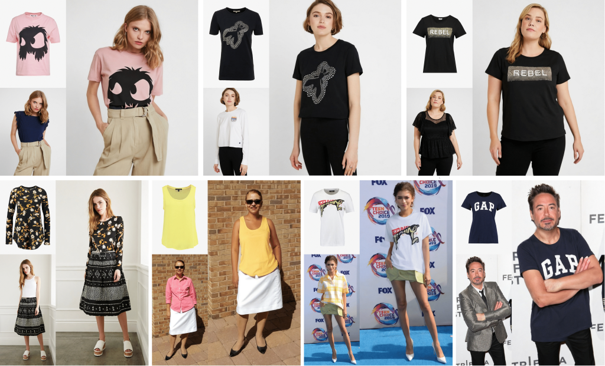

# Virtual FittingRoom
This repository has model inherited from (https://arxiv.org/abs/2312.01725)

> **[CVPR2024] StableVITON: Learning Semantic Correspondence with Latent Diffusion Model for Virtual Try-On**<br>
> [Jeongho Kim](https://scholar.google.co.kr/citations?user=ucoiLHQAAAAJ&hl=ko), [Gyojung Gu](https://www.linkedin.com/in/gyojung-gu-29033118b/), [Minho Park](https://pmh9960.github.io/), [Sunghyun Park](https://psh01087.github.io/), [Jaegul Choo](https://sites.google.com/site/jaegulchoo/) 

[[arXiv Paper](https://arxiv.org/abs/2312.01725)]&nbsp;
[[Project Page](https://rlawjdghek.github.io/StableVITON/)]&nbsp;

&nbsp;


## Citation
Credited to:
```
@artical{kim2023stableviton,
    title={StableVITON: Learning Semantic Correspondence with Latent Diffusion Model for Virtual Try-On},
    author={Kim, Jeongho and Gu, Gyojung and Park, Minho and Park, Sunghyun and Choo, Jaegul},
    booktitle={arXiv preprint arxiv:2312.01725},
    year={2023}
}
```

**Acknowledgements** Sunghyun Park is the corresponding author.

## License
Licensed under the CC BY-NC-SA 4.0 license (https://creativecommons.org/licenses/by-nc-sa/4.0/legalcode).
